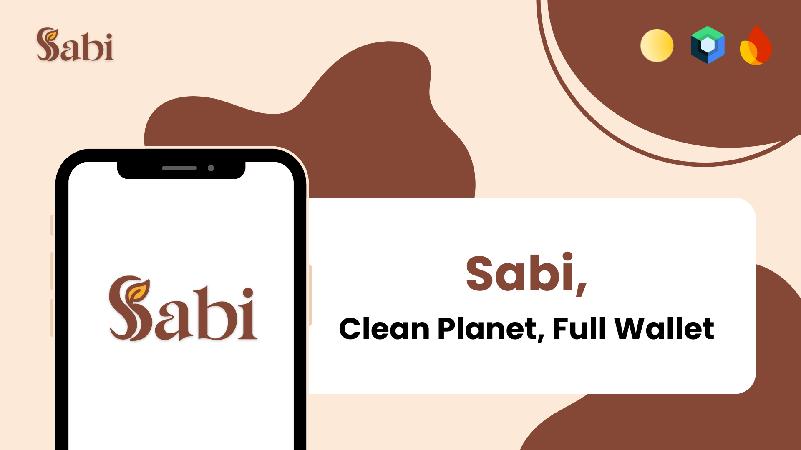
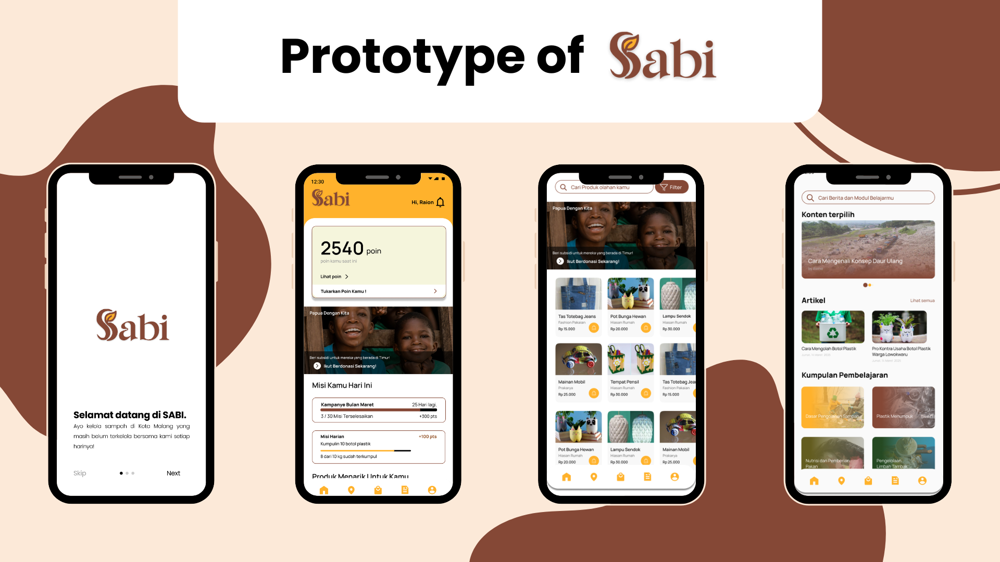
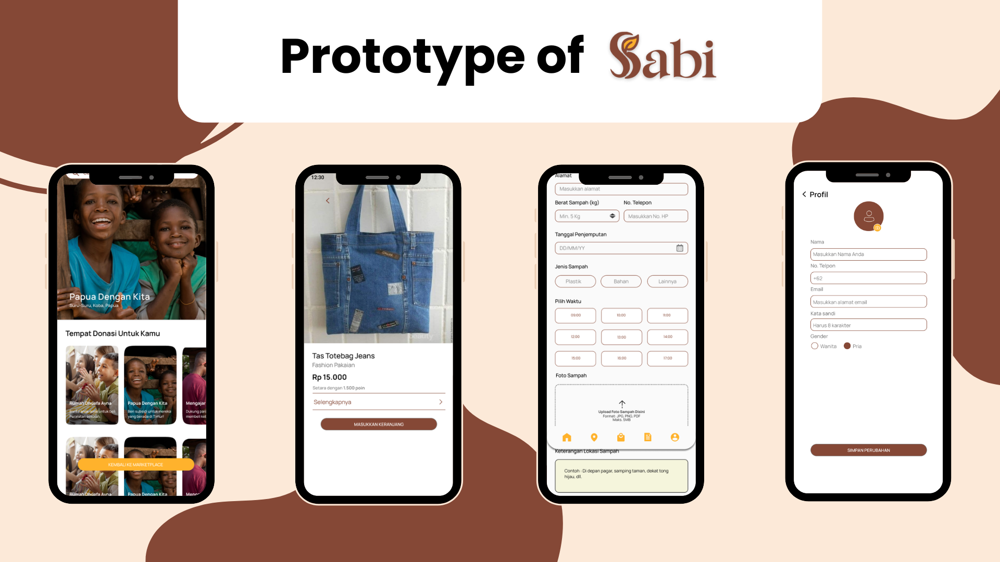

<h2 align="center">
  <b>SABI (Sampah Bisa Jadi Berarti) - Mobile App (Jetpack Compose) 🌱</b> 
</h2>

As a team passionate about sustainable tech solutions, we developed this **Mobile App for Smart Waste Management** to empower individuals in turning everyday waste into meaningful contributions. Through this platform, users can donate waste, collect reward points, and exchange them into money, donate to orphanages, or support local UMKM businesses.

This project was created collaboratively as part of the **Internship Raion 2025**, where we aimed to combine social impact with thoughtful mobile development. Built using **Jetpack Compose and Firebase**, the app showcases clean architecture practices while focusing on real-world community challenges.

Our goal is to encourage **responsible waste behavior, support local economies**, and make sustainability accessible through technology. The project is still growing, and we're excited to keep improving it together!

Feel free to explore, share feedback, or get inspired. Let's make sustainability smarter—together! 🌱💡🚀

## ✨ Features (MVP)

The following features were implemented as part of the app's initial MVP:

- ♻️ Waste donation system with point rewards
- 💰 Point exchange to money (manual request)
- 🛍️ Marketplace for UMKM products using points and money (manual request)
- 🗺️ Daily waste pickup route (displayed as a visual map)
- 🚚 Request waste pickup for donations over 5kg
- 📚 Educational resources via external links
- 🎯 Daily eco-challenges to boost engagement

## 🛠️ Tech Stack

- Kotlin + Jetpack Compose (UI)
- Firebase (Authentication, Realtime Database)
- Uploadcare
- Clean Architecture pattern
- Manual point-to-cash conversion (without banking API)

## 🧠 Architecture

This app follows the Clean Architecture principles:
- `presentation` layer for UI and interaction
- `domain` layer for business logic
- `data` layer for data handling and mapping

## 📸 Screenshots

## 👥 Group 5 Internship Raion 2025 

abc
